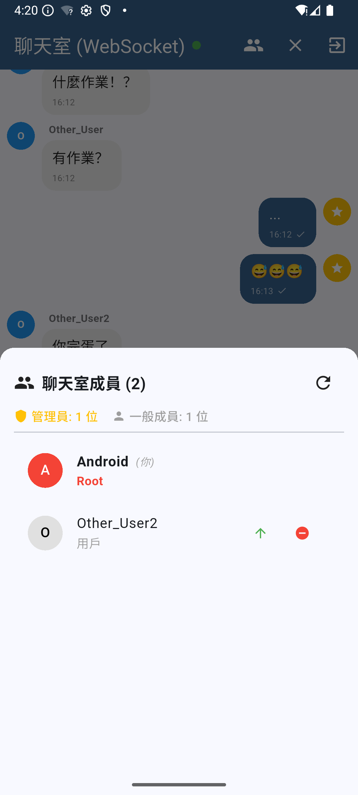
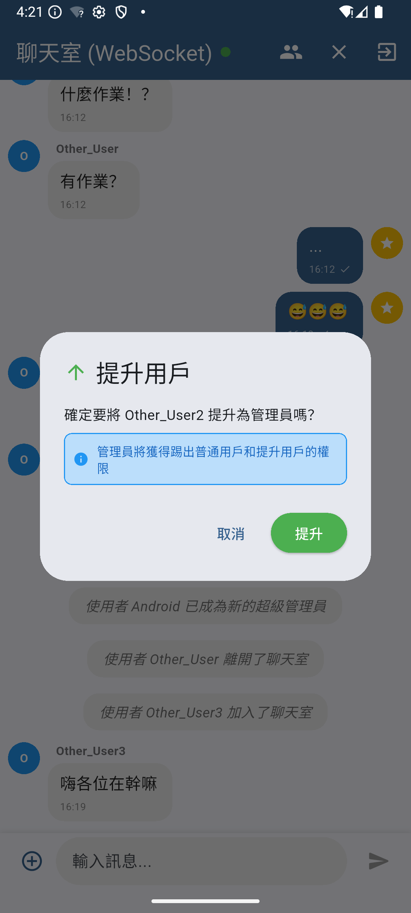
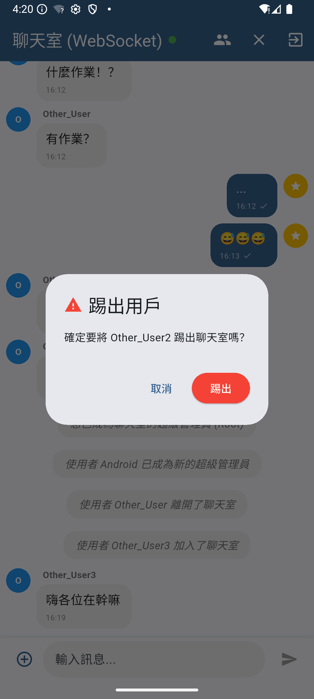
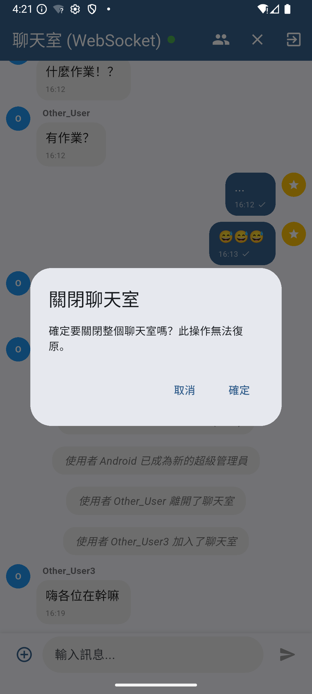

# ChatRoom (Android/iOS)

## 功能介紹

這是一個基於 WebSocket 和 Socket 的即時通訊應用程式，

### 1. 使用者管理
- **提升用戶為管理員**：管理員可以提升普通用戶為管理員。
- **降級管理員**：超級管理員（Root）可以降級管理員為普通用戶。
- **踢出用戶**：管理員和超級管理員可以踢出普通用戶。

### 2. 即時訊息
- **文字訊息**：支援 Markdown 格式，包含標題、粗體、斜體、程式碼塊等。
- **系統訊息**：顯示聊天室的系統通知，例如用戶加入或離開聊天室。
- **打字提示**：顯示正在輸入訊息的用戶。

### 3. 聊天室管理
- **關閉聊天室**：管理員或超級管理員可以關閉聊天室。
- **用戶列表**：顯示聊天室中的所有成員，包含管理員和普通用戶。

### 4. 平台支援
- **多平台**：支援 Android、iOS，Web可前往 [ChatRoom Web](https://chatroom.example.com) 使用。
- **深色模式**：根據系統設定自動切換深色或淺色主題。

---

## 使用方式

### 1. 登入聊天室
1. 啟動應用程式後，輸入使用者名稱：
   - **使用者名稱**：2-20 個字符，支援中文、英文字母、數字、底線和連字號。
   - **伺服器地址**：例如 `127.0.0.1` 或 `10.0.2.2`。
   - **伺服器端口**：介於 1-65535 的有效端口號，例如 `8080`。
2. 點擊「進入聊天室」按鈕。

### 2. 發送訊息
- 在訊息輸入框中輸入文字，點擊「發送」按鈕。

  

### 3. 管理用戶
- 點擊用戶列表中的用戶，選擇以下操作：
  - **提升為管理員**：需要管理員或超級管理員權限。
  - **降級為普通用戶**：需要超級管理員權限。
  - **踢出用戶**：需要管理員或超級管理員權限。   

  
  
  

### 4. 關閉聊天室
- 管理員或超級管理員可以在聊天室右上角選擇「關閉聊天室」。

    

---

## 開發者指南

### 環境需求
- **Flutter SDK**：請確保已安裝最新版本的 Flutter。
- **依賴套件**：
  - `web_socket_channel`：用於 WebSocket 通訊。
  - `flutter`：用於跨平台 UI 開發。

### 啟動應用程式
1. 在專案目錄中執行以下命令：
   ```bash
   flutter run